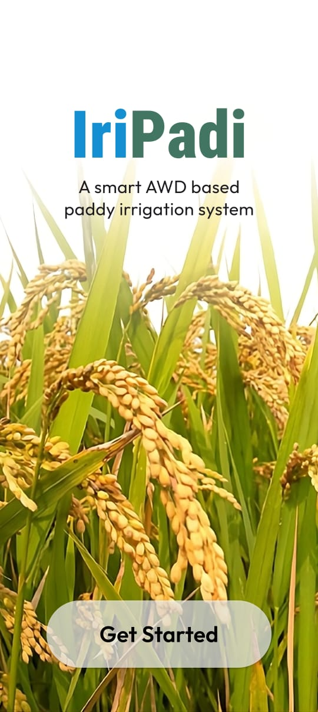
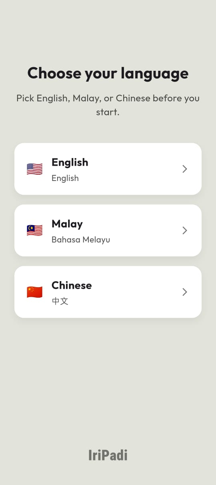
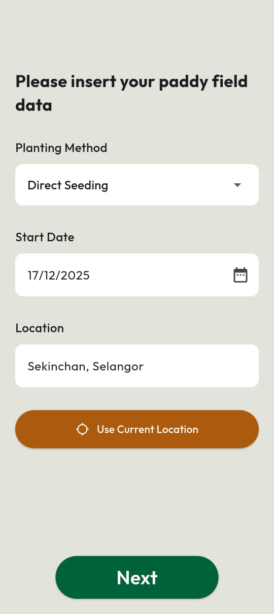
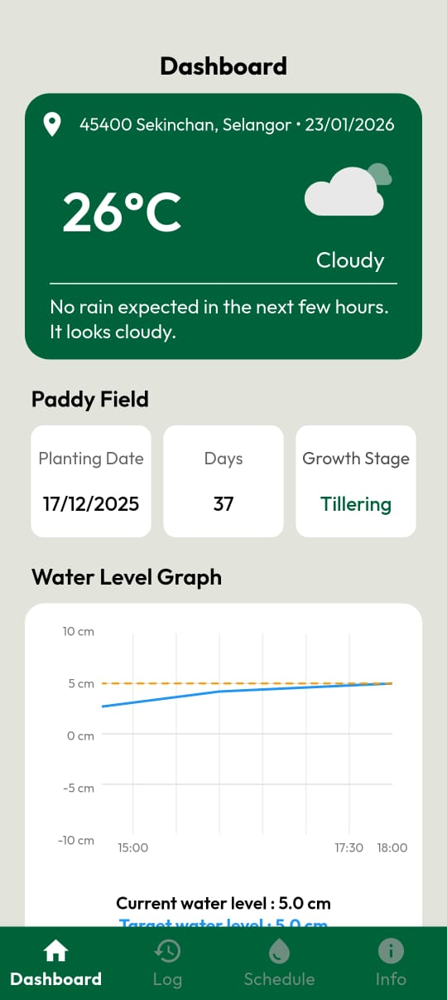
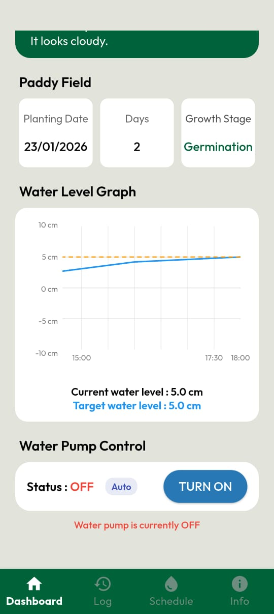
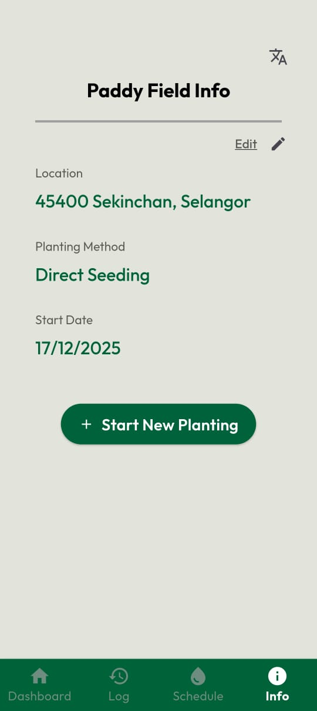
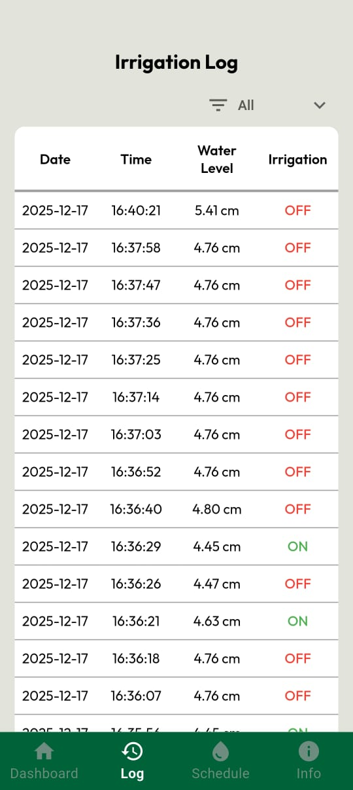
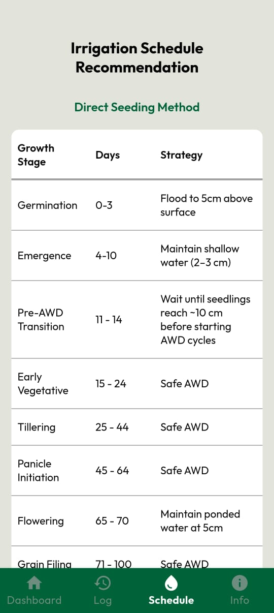
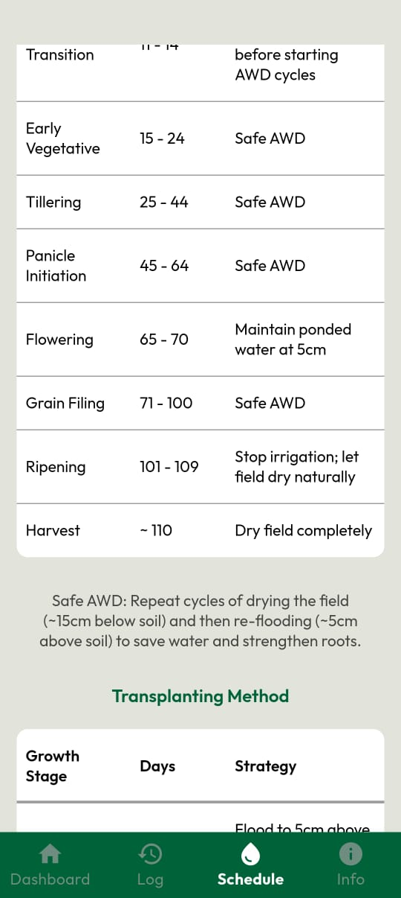

# IriPadi

**IriPadi** is a Flutter mobile app that automates irrigation for paddy (rice) fields using the **Alternate Wetting and Drying (AWD)** technique. It was built as a Final Year Project, combining a mobile app, an IoT sensor/actuator setup, and a machine learning model into one end-to-end smart irrigation system.

Instead of keeping fields continuously flooded, IriPadi tracks the crop's growth stage and current water level, then decides when the water pump should turn on or off — either automatically via a trained ML model, or manually by the farmer through the app. This reduces water usage while keeping the crop at the right water level for each growth stage.

## App walkthrough

This walks through the app in the order a farmer actually uses it, from first launch to daily monitoring.

### 1. Start page



The landing screen shown on first launch, introducing the app as "a smart AWD based paddy irrigation system" with a **Get Started** button that begins onboarding.

### 2. Language selection



First-time setup step where the farmer picks English, Malay, or Chinese. The choice is saved and can be changed later from the Field Info page.

### 3. Field setup



The farmer enters the **planting method** (e.g. Direct Seeding), **start date**, and **location** (typed manually or filled in via "Use Current Location"). This profile drives every downstream calculation: days after planting, growth stage, and the location used for weather lookups.

### 4. Dashboard — overview



The home screen after setup. It shows current weather and a short forecast summary for the field's location, a **Paddy Field** card (planting date, days since planting, current growth stage), and a live **Water Level Graph** plotting the current water level against the target level for that growth stage.

### 5. Dashboard — pump control



Scrolling down the dashboard reveals **Water Pump Control**: the current pump status (ON/OFF), whether it's in **Auto** (ML-decided) or **Manual** mode, and a toggle button so the farmer can override the pump directly from the app.

### 6. Field info



A read-only summary of the active field profile (location, planting method, start date) with an **Edit** action to update it, and a **Start New Planting** button to reset the profile and begin a new growing cycle.

### 7. Irrigation log



A chronological, filterable table of every recorded reading: date, time, measured water level, and whether irrigation (the pump) was ON or OFF at that moment — pulled from Firebase for auditing and monitoring pump behavior over time.

### 8. Schedule recommendation



The AWD reference schedule for the selected planting method, listing each **growth stage**, its **day range**, and the **water-management strategy** for that stage (e.g. "Flood to 5cm above surface" during germination, "Safe AWD" during tillering).

### 9. Schedule recommendation (continued)



The rest of the schedule through ripening and harvest, plus a note explaining the Safe AWD cycle (drying to ~15cm below soil, then re-flooding to ~5cm above), and the same table repeated for the Transplanting planting method.

## How it works

```
Mobile App (Flutter)  --field profile, growth stage, rainfall-->  ESP12F Gateway
ESP12F Gateway  --water level + mobile payload-->  Raspberry Pi (Flask + XGBoost)
Raspberry Pi  --auto/manual decision-->  Relay -> Water Pump
Raspberry Pi  --logs & live status-->  Firebase Realtime Database
Firebase Realtime Database  --live sync-->  Mobile App
```

1. The farmer sets up a field profile in the app (planting method, planting date, location).
2. The app computes days after planting and the current growth stage, and fetches rainfall data from a weather service.
3. This data is sent to an ESP12F gateway on the field, which also reads the current water level from an ultrasonic sensor.
4. The combined data is forwarded to a Raspberry Pi running a Flask server, which either applies the farmer's manual override or runs a trained **XGBoost** model to decide whether irrigation is needed.
5. The Raspberry Pi actuates the water pump relay and logs the decision to **Firebase Realtime Database**.
6. The app subscribes to Firebase in real time, showing live pump status, a water level graph, and historical irrigation logs.

## Features

- **Field profile setup** — planting method, planting date, and location, used to derive days-after-planting and growth stage.
- **AWD growth-stage guidance** — recommends safe water levels/strategy for each growth stage (germination, tillering, panicle initiation, flowering, etc.).
- **Real-time water level monitoring** — live graph of current vs. target water level, streamed from Firebase.
- **Automatic & manual pump control** — ML-based auto mode, with a manual override switch for the farmer.
- **Weather-aware decisions** — pulls rainfall forecasts so the system can account for rain when deciding to irrigate.
- **Irrigation history/log** — records of past pump actions for monitoring and validation.
- **Irrigation scheduling** page for planning ahead.
- **Multi-language support** with a language selection screen on first launch.
- **Firebase Authentication** (anonymous sign-in) and per-user data isolation in Firebase RTDB.

## Tech stack

- **Mobile app:** Flutter (Dart), Provider for state management, Firebase Auth + Realtime Database, `fl_chart` for graphs, `geolocator`/`geocoding` + Google Places for location input, Lottie for weather animations.
- **Machine learning:** XGBoost model trained in Python (`train_irrigation_xgb.py`, `Irrigation_XGBoost_Model.ipynb`) to predict irrigation need from growth stage, water level, and weather inputs.
- **Field gateway:** ESP12F (ESP8266) with an ultrasonic water-level sensor, programmed in Arduino/C++ (`Water_depth_test.ino`).
- **Decision server:** Raspberry Pi running a Flask API (`app.py`) that loads the trained model, applies manual/auto logic, and drives a relay via `RPi.GPIO`.
- **Backend:** Firebase Realtime Database for live sync and historical logging.

## Project structure

```
lib/
  main.dart              # App entry point, providers, routing
  pages/                 # Screens: home, dashboard, field info, log, schedule, login, language selection
  widgets/                # Reusable widgets & state providers (form data, growth stage, locale, charts)
  weather/                # Weather data model, service, and provider
  database/               # Firebase Realtime Database service

android/, ios/, web/, windows/, linux/, macos/   # Flutter platform targets

app.py                       # Raspberry Pi Flask server: ML inference + pump relay control
train_irrigation_xgb.py      # XGBoost model training script
Irrigation_XGBoost_Model.ipynb  # Model development/experimentation notebook
Water_depth_test.ino         # ESP12F/Arduino sketch for the ultrasonic water-level sensor
```

The Raspberry Pi server (`app.py`) and ESP12F sketch (`Water_depth_test.ino`) are part of the hardware side of the system and are meant to run on their respective devices (Raspberry Pi and ESP8266/ESP12F), not on the mobile app's host machine.
